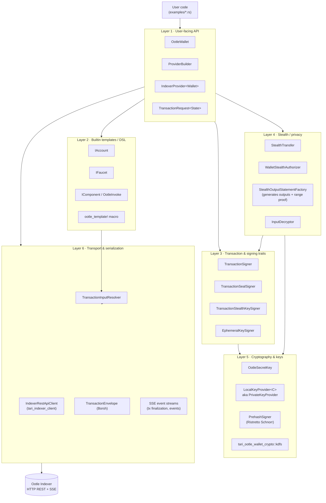

# 01 — Architecture

`ootle-rs` is shaped as a layered client. The upstream README pitches a
four-layer "alloy" model (Core / Transport / Provider / Signer). The actual
code adds a couple more layers because Tari has features Ethereum-style
clients don't (stealth transfers, view-only decryption, multi-key wallets).

## Layered view

| # | Layer                       | What lives here                                                                                                      | Modules                                              |
|---|-----------------------------|----------------------------------------------------------------------------------------------------------------------|------------------------------------------------------|
| 1 | **User-facing API**         | `OotleWallet` (multi-key store + signer), `IndexerProvider`, `ProviderBuilder`, `TransactionRequest<State>`         | `wallet/`, `provider/`, `types/`                     |
| 2 | **Builtin templates / DSL** | Type-safe builders for Account / Faucet / generic Components and the `ootle_template!` macro                         | `builtin_templates/`, `macros.rs`                    |
| 3 | **Transaction & signing**   | `TransactionSigner`, `TransactionSealSigner`, `TransactionStealthKeySigner`, `EphemeralKeySigner`                   | `transaction/`, `signer/`                            |
| 4 | **Stealth / privacy**       | `StealthTransfer` builder, `Output`, `SignatureRequirements`, `WalletStealthAuthorizer`, `StealthOutputStatementFactory` | `stealth/`, `wallet/stealth.rs`                  |
| 5 | **Cryptography & keys**     | `OotleSecretKey` (account + view-only secret), `LocalKeyProvider`, `PrivateKeyProvider`, prehash signers             | `keys/`, `key_provider/`                             |
| 6 | **Transport & serialization** | `IndexerRestApiClient` (from `tari_indexer_client`), `TransactionEnvelope` (Borsh), serde JSON, SSE event streams  | `provider/indexer.rs`, `provider/event_watcher.rs`, `provider/tx_watcher.rs`, `provider/tx_stream.rs` |

The numbering is for clarity; layers below 1 are reachable directly when
needed (e.g. you can implement your own `NetworkWallet` and skip
`OotleWallet`).

## Block diagram

## State management

`ootle-rs` is mostly **stateless** — there is no client-side cache of
transactions, balances, nonces, or UTXOs across calls. What state does live
in the client:

- `IndexerProvider<Wallet>` (`crates/wallet/ootle-rs/src/provider/indexer.rs:46-52`)
  holds:
  - `Arc<IndexerRestApiClient>` — the shared HTTP client (connection pool
    lives inside `tari_indexer_client`).
  - `Wallet` — the user's wallet (key material, address book).
  - `Network` — captured at builder time.
  - `tx_timeout: Duration` — default per-transaction watch timeout.
  - `Arc<OnceLock<TransactionWatcherHandle>>` — a lazily-spawned background
    Tokio task that subscribes to the indexer's SSE event stream once any
    transaction is awaiting finalization. Initialised on the first
    `send_transaction` call.
- `OotleWallet` (`crates/wallet/ootle-rs/src/wallet/ootle.rs:28-32`) holds:
  - A default `Address`.
  - `HashMap<Address, Arc<dyn WalletKeyProvider>>` — registered signers,
    each one keyed by its own address. Multiple key providers per wallet
    are supported; this is how multi-signer transactions are authorised.
- `TransactionInputResolver`
  (`crates/wallet/ootle-rs/src/provider/input_resolver.rs:43-46`) holds a
  per-call HashMap cache of `SubstateId -> Option<SubstateValue>`. This is
  scoped to a single resolution pass; it does not survive between
  transactions.

## Data-flow summary

A typical `prepare → build → send → watch` cycle traverses the layers in
this order:

1. Layer 2 builder (`IAccount`, `IFaucet`, `IComponent`, or a macro-generated
   wrapper) accumulates instructions and a `HashSet<WantInput>`.
2. `prepare()` calls Layer 1's `Provider::resolve_input_want_list()`, which
   delegates to `TransactionInputResolver` (Layer 6) for substate fetches
   to satisfy each `WantInput`. The result is an `UnsignedTransaction`.
3. `TransactionRequest<WithTx>::build(seal_signer)` (Layer 1) folds in any
   pre-collected `TransactionAuthorization`s, then asks the seal signer
   (Layer 3, usually `OotleWallet` itself) to seal the transaction with its
   default key. Sealing internally calls Layer 5
   (`OotleSecretKey::sign_prehash`).
4. `IndexerProvider::send_transaction()` (Layer 1) Borsh-encodes the
   transaction (`TransactionEnvelope::encode`, Layer 6), POSTs it via the
   indexer client (Layer 6), and returns a `PendingTransaction` whose
   `watch()` future awaits a finalization event from the SSE watcher.

[09-end-to-end-flow.md](09-end-to-end-flow.md) traces the same path with
exact `file:line` references.

## Concurrency model

Async end-to-end (Tokio). All public network operations are `async fn`. The
crate uses `async-trait` on dyn-compatible traits (signers) and bare `impl
Future` on those that don't need to be dyn-compatible (`Provider`,
`UnsignedTransactionBuilder`, `NetworkWallet`). The transaction watcher
runs as a single `tokio::task::spawn`'d background actor receiving requests
on an `mpsc` channel and SSE events from the same stream
(`crates/wallet/ootle-rs/src/provider/tx_watcher.rs:76-98`).
